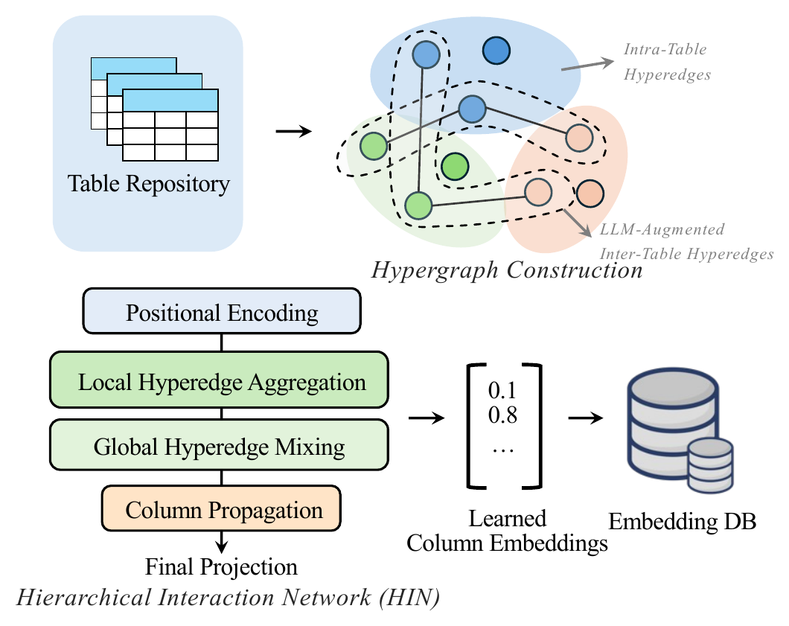
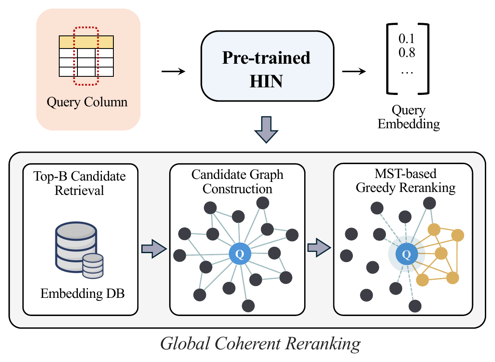

# HyperJoin: LLM-augmented Hypergraph Link Prediction for Joinable Table Discovery

**PVLDB 19(13), 2026** — Shiyuan Liu, Jianwei Wang, Xuemin Lin, Lu Qin, Wenjie Zhang, Ying Zhang

[Full paper](full_version/VLDB_26_HyperJoin_Online_Full_version.pdf) · [DOI](https://doi.org/10.14778/3849398.3849405) · [Quick start](#quick-start) · [Code](#code-navigation) · [Citation](#citation)

HyperJoin constructs a dual-type hypergraph from tables and their augmented columns, and learns column representations with a hierarchical interaction network (HIN). At query time it retrieves cosine-similarity candidates and reranks them with a maximum spanning tree for coherent result sets.

This repository is the research artifact accompanying the paper; it provides the model, pipeline, and a self-contained demo rather than turnkey reproduction of the full benchmark.

<table>
  <tr>
    <td></td>
    <td></td>
  </tr>
  <tr>
    <td><em>The offline phase of HyperJoin, which constructs the hypergraph and learns column representations with HIN.</em></td>
    <td><em>The online ranking phase of HyperJoin, which performs global coherent reranking over the candidate pool.</em></td>
  </tr>
</table>

## Quick start

From the repository root:

```bash
pip install -r requirements.txt
python test/run_demo.py
```

The demo runs the full chain — data generation, training (3 epochs on CPU), and MST-reranked search — on five bundled sample tables.

- Uses rule-based perturbation: no API access required.
- Prints Precision/Recall/F1@K for K in {1, 5, 10, 15, 20, 25}.
- Generated artifacts land in `test/data/` (datasets) and `results/demo/` (checkpoints, metrics, logs); both are git-ignored.

See [test/README.md](test/README.md) for what each file does. Dependencies are listed in [requirements.txt](requirements.txt); `openai` and `fasttext` are installed by it but only used on the optional LLM / FastText paths described below.

If the FastText model is absent, the demo falls back to deterministic embeddings — sufficient as a smoke test of the pipeline, but not indicative of paper performance.

## Using your own data

Download the evaluation dataset used in the paper here: **[UK_SG](https://drive.google.com/drive/folders/1Ttb6nrt05J6VG2FdF6_jEKoU-zWpSyL2?usp=sharing)**.

The scripts expect datasets under `datasets/Lake/<dataset>/` by default; pass `--data_root` to `train.py`/`search.py` to use a different location. Two kinds of dataset directories are involved:

- **Evaluation dataset** (e.g. `UK_SG`): `query.npy` / `target.npy` (column embeddings), `query_metadata.pkl` / `target_metadata.pkl` (display names), and `t=0.2/test/index.csv` (ground truth required for evaluation).
- **Training dataset** (e.g. `UK_SG_LabelFree`): generated by `src/datagen.py`; contains `target.npy`, `target_metadata.pkl`, and `self_supervised_pairs.pkl` (the label-free training pairs).

The `test/` folder contains the raw fixtures (`tables/*.csv`, `query.csv`, `target.csv`, `index.csv`, metadata JSON) that `test/run_demo.py` converts into this format — see [test/README.md](test/README.md) for the precise input layout.

To generate label-free training pairs from your own raw tables:

```bash
python src/datagen.py --datasets UK_SG --data_dir path/to/raw_tables --use_llm 0
```

`--output_dir` sets the output base directory (default `datasets/Lake/<datasets>`); datagen appends a `_LabelFree` suffix, so the above writes `datasets/Lake/UK_SG_LabelFree/`, which is the name you pass to `--dataset` when training. The example explicitly selects rule-based perturbation with `--use_llm 0` — datagen requires this flag to be set one way or the other. Pass `--use_llm 1` and set `LLM_BASE_URL` / `LLM_API_KEY` / `LLM_MODEL_ID` to enable LLM perturbation (see [test/README.md](test/README.md) and `src/llm_augmentation.py`).

The paper configuration is a triplet loss with margin 1.0, learning rate 4e-4, batch size 64, and 30 epochs; `--edge_mask_ratio 0.2` splits the augmented positive pairs 80% support / 20% prediction.

<details>
<summary>Training and search commands</summary>

```bash
python src/hypergraph/train.py \
    --dataset UK_SG_LabelFree \
    --loss_type triplet \
    --lr 4e-4 \
    --dropout 0.05 \
    --embed_dim 512 \
    --patch_gnn_layers 2 \
    --num_mixer_layers 2 \
    --num_layers 1 \
    --use_residual 1 \
    --margin 1.0 \
    --edge_mask_ratio 0.2 \
    --hard_neg_ratio 1.0 \
    --epochs 30 \
    --batch_size 64 \
    --device cuda \
    --output_dir ./results/UK_SG
```

The best checkpoint is saved to `<output_dir>/<dataset>/best_model.pth`. Search and evaluation:

```bash
python src/hypergraph/search.py \
    --dataset UK_SG \
    --model_path ./results/UK_SG/UK_SG_LabelFree/best_model.pth \
    --use_mst \
    --mst_alpha 0.0 \
    --mst_lambda 1.0 \
    --mst_candidate_size 50 \
    --mst_top_l_neighbors 20 \
    --top_k 25 \
    --device cuda \
    --seed 42
```

</details>

Search outputs (evaluation metrics, per-query logs) are written to `results/column_hypergraph_mst/` by default; set `EXPERIMENT_DIR` to override. The demo uses `results/demo/`.

## Code navigation

| Path | Contents |
|---|---|
| [datagen.py](src/datagen.py), [llm_augmentation.py](src/llm_augmentation.py) | Label-free pair generation; LLM-augmented inter-table hyperedges |
| [construction.py](src/hypergraph/construction.py) | Hypergraph construction, batching, losses |
| [model.py](src/hypergraph/model.py), [layers.py](src/hypergraph/layers.py), [intra_edge_gnn.py](src/hypergraph/intra_edge_gnn.py) | HIN model: positional encodings, intra-hyperedge GNN, hypergraph-aware mixer |
| [train.py](src/hypergraph/train.py), [search.py](src/hypergraph/search.py) | Self-supervised training; search + MST reranking |
| [mst_reranker/](src/mst_reranker/) | Coherence-aware reranking (greedy MST, explicit MaxST, coherence metrics) |
| [evaluator.py](src/evaluator.py), [data.py](src/data.py), [utils.py](src/utils.py) | Precision/Recall/F1 evaluation, dataset classes, utilities |
| [test/](test/) | Self-contained demo (see [test/README.md](test/README.md)) |
| [full_version/](full_version/) | Online full paper with appendix |

## Citation

If you find this work useful, please cite:

```bibtex
@article{liu2026hyperjoin,
  author    = {Liu, Shiyuan and Wang, Jianwei and Lin, Xuemin and Qin, Lu and Zhang, Wenjie and Zhang, Ying},
  title     = {HyperJoin: {LLM}-augmented Hypergraph Link Prediction for Joinable Table Discovery},
  journal   = {Proceedings of the VLDB Endowment},
  volume    = {19},
  number    = {13},
  pages     = {5066--5079},
  doi       = {10.14778/3849398.3849405},
  year      = {2026},
  url       = {https://github.com/T-Lab/HyperJoin}
}
```
